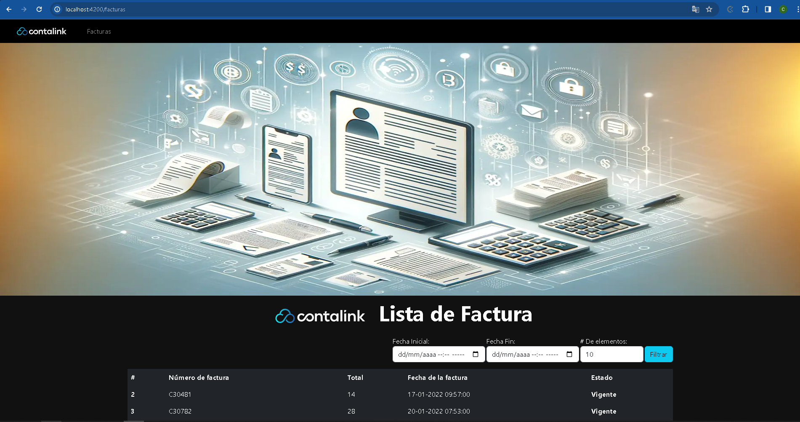
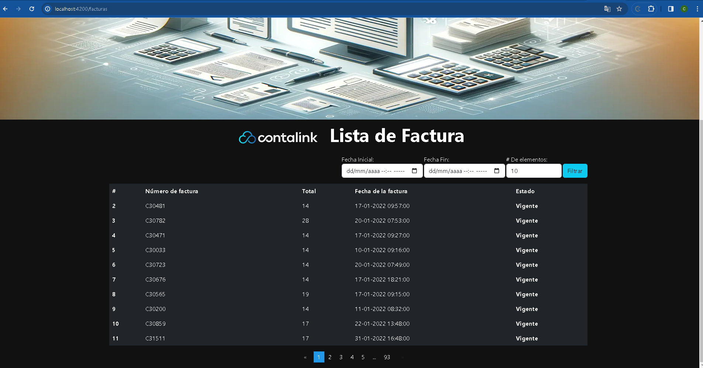

# Facturas

## Proyecto Angular

Este proyecto fue generado con [Angular CLI](https://github.com/angular/angular-cli) versión 13.2.1.

## Requisitos para la ejecución del proyecto 

Antes de ejecutar el proyecto, asegúrate de tener instalados los siguientes requisitos:

- [Node.js](https://nodejs.org/)
- [npm](https://www.npmjs.com/)
- [PostgreSQL](https://www.postgresql.org/)

## Dependencias

Instala las dependencias utilizando el siguiente comando:

```bash
npm install
```
## Servidor de Desarrollo

Ejecuta `npm start` para iniciar un servidor de desarrollo. Navega a `http://localhost:4200/`. La aplicación se recargará automáticamente si realizas cambios en alguno de los archivos fuente.

```bash
npm start
```

## Construcción

Ejecuta `npm build` para compilar el proyecto. Los artefactos de compilación se almacenarán en el directorio `dist/`.

```bash
npm build
```
## Ejecutar Pruebas End-to-End

Ejecuta `npm e2e` para ejecutar las pruebas end-to-end a través de una plataforma de tu elección. Para usar este comando, primero debes agregar un paquete que implemente capacidades de prueba end-to-end.

```bash
npm e2e
```
## Ayuda Adicional

Para obtener más ayuda sobre Angular CLI, utiliza `ng help` o visita la página [Angular CLI Overview and Command Reference](https://angular.io/cli).


## Proyecto Ejecutado 

### Evidencias
#### HOME

#### Tabla de resultado
